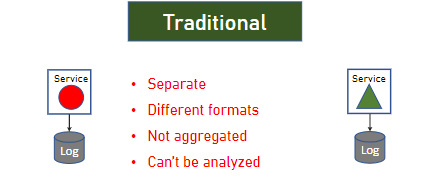

# Microservices
# 2. `History of Microservices and problem with monolith and SOA`
This is result of problem with 2 architrcture paradiagms `Monolith` and `SOA`
## 2.1 `Monolith`
 - original art where all sw component are exected in single process
 - No distribution of any kind
 - Strong coupling between all classes
 - Implemented as Silo

 Example: We have 2 app `HR App` and `Purchasing App`. It works good but one day they need comunication each others to know some more inforation as what HR for that Purchasing. Monolith doesn't support for that, do not expose ways to share data functionality. It can be done but it's not easy

 `Pros`
 - Easier to design
 - Performance if we develop correcly (No network, no seriablization, no deserialization layers, all core in process) about theory it should faster than distributed systems

 `Problem`
 - All components must be developed using same development flatform
 - Future upgrade is a problem - need to upgrade the whole app
 - Inflexing Deployment - Always deploy for whole app -> cost and risk a lot
 - Infficient Compute Resources - accross all components - no ways to know the specific component need more resources.
 - Large and Complex code base - hard to maintain, a little change requires long process because impact to whole application so develop will try the best not to change anything and lead to system obsolete quite q2uickly

 ## 2.2 `Service Oriented Architecture (SOA)`

 SOA is about sharing and giving, sharing capabilities using a well-defined API
 - Fist cointed in 1998
 - Apps are services exposing functionality to outside world
 - Services expose metadata to declare their functionality
 - Usually implemented using SOAP and WSDL
 - Usually implemented with `ESB` - Enterprise Service Bus that were design to mediate between the client and services and between the services themselves - so ESB provides all the cross-cutting concerns as authentication, routing, validation, monitoring and more - look good on paper but turned out to be a huge problem

 Example - 2 App HR services and Purchase Services. 
 Thoese expose SOAP apis. Using that endpoint the services can comnunicate with each others. Client interacts `ESB` which comunicates with the services, `ESB` know the real target services and routers the request to appropriated services => `Client have no ideas about real services just know how to talk with ESB and it lead to some problems` 

`Pros`
- Sharing data & functionality
- Polyglot between Services

`Problems`
- ESB is one of main components and it can become bloated and expensive - It was built by IBM or Oracle - It's extremely expensive, complex from start
- ESB do anything, when a single piece of code tries to do everything it usally doesn't end well
- Difficuylt to maintain
- Lack of tooling - testing and deployment were manly manual processes and take a lot of time
- Take longer time to build a monolith

# 4. `Microservices Architecture`
- Has to be modular with simple API
- Term first appreared in 2011

`Characteristics of Microservices`
- Componentization via Services
- Organized Around Bussiness Capabilities
- Products not Projects
- Smart endpoints and Dump Pipes
- Decentralized Governance
- Decentralized Data Management
- Infastructure Automation
- Design for Failure
- Evolutionary Design

### 4.1 `Componentization via Services`
- Modular is always a good idea
- Components are the parts that together compose the software
- Modularity can be achieved using:
  - liberies - called directly within the process with pros is good performance -  there are no mediators bw our components
  - services - called by out-of-process mechanism (WebAPI, RCP)

In microservices we prefer using Services for componentization and not liberies
Just use liberties in the case that is a part of service and that is service itself

- Motivation
  - Independent deployment
  - Well defined interface

### 4.2. `Organized Around Business Capabilities`
- Every sevice is handled by a single team. responsible for all aspects -from UI -> DB so team have same goal, has holistic view of serices that is better in develop the app
(monolith can share responsible by horizontal from UI is a team to DB is another team)

Motivation
 - Quick development
 - Well-defined boundaries

### 4.3 `Products not Projects`

- In traditional projects, the goal is deliver a working code
- With microservices, the goal is deliver a working product
"You build it, you run it"

Motivation
- Increase customer's satisfaction
- Change developer's mindset

### 4.4 `Smart Endpoints and Dump Pipes`
- Microservice systems use "dumb pipes"- simple protocols
- Strive to use what the web already offers

Important notes:
 - Direct conenctions between services is not a good idea because when one of them change the endpoint all of them have to update
 - Better use discovery services or a gateway

Motivation
- Accelerate develop
- Make app easiser to maintain

### 4.5 `Decentralized Governance`
- Each team is fully responsible for it's service
- Enabled the loosely coupled nature of Microservices
- polyot flatform

### 4.6 `Decentralized Data Management`
- It service own database

Important notes
- This is most controversial atrribute of Miicroservices
- Raises problems such as distributed transaction, data duplication and more

Motivation
- Right tool for right task - having the right database is important
- Encourages isolation

### 4.7 `Infrastructure Automation`
Tooling greatly helps in deployment using
 - Automated Testing
 - Automated Deployment

### 4.8 `Infrastructure Automation`
- For Microservices automation is essential
- Short deployment cycles are a must
- Can't be done manually
- There are a lot of automation tools - Gitlab, Jenkins

Motivation
- Short deployment cycles

### 4.9 `Design for Failure`
- Microservices have lot of processes and a lot of network traffic.
- A lot can go wrong

=> The code must assume failure can happen and hanle it greacefully
=> Extensive logging and monitoring should be in place to catch the errors and raise alerts when they happen

### 2.10 `Evolutionary Design`
- The move to Microservives should be gradual
- No need to break everything apart
- Start small and upgrade each part separately

# 5. `Problems solved`
- Single technology Platform
- Inflexible Deployment
- Inefficient Compute Resource
- Large and Complex in codebase
- Complicated and Expensive ESB
- Lack of tooling

# 6. `Designing Microservices Architechture`
- Designing should be methodical
- Do not rush into development - "plan more, code less"
- Critical to the success of system

The Architecture Process
- Understand the System's Requirements
- Understand the Non-Functional Requirements
- Map to Components
  - Mapping
  - Communication Patterns
- Select the Technology Stack
- Design the Architecture
- Write Architecture Document
- Support the team

## 6.1 `Mapping to Component - Mapping - most imprtant step in whole process`
- Determines how the system will look like in long run
- Once set - not easy to change => taken very seriously

=> This step will literally shape the system

What is it ?
- Defining the various componenets of the system
- Remembers: Components =  Services

`Mapping`

Mapping should be based on
- `Bussiness requirements`
  - The collection of requiments arround a specific bussiness capability
- `Functional autonomy`
  - The maximun functionality that does not involve other bussiness requirements
- `Data Entities`
  - Services is designed around well specified data entities
- `Data autonomy`
  - Underlying data is an atomic unit
  - Service does not depend on data from other serices to function properly
  `Example`: Employee service that relies on Addresses service to return employee's data => this is a major sign that our architecture is not optimized, righ thing is to include the Addresses data in the Employees service => make service litle bit larger but alternative is much worse, we really need our services to be autonomous 

  We still have the relationship bw services - `one services can realate to data in other services as long as this relationship is done using ID of the entity and not the entity itseft`

`Edge case #1`
 - Retrieve all customers from HN with total number of orders for each customer. It related to 2 service orders and customers
   | Customer name | No of orders |
   | ------------- | ------------ |
   | Thanh         | 10           |
   | Thao          | 15           |

`We have three approaches to resolve #1`
- `Data Duplication`
  - We have 2 service Orders and Customers and the number of oders stored not only in Order service database but also in the Customer database => there is anychange on number of orders then we need to update in both Customers and Orders service
- `Service query`
  - Customer service go  Orders service and retrieves the number of orders for each customer => Orders db store the Customer IDs that made the order => problem for this is network and service when we have 200 customer we have to access Order serives 200 times that is a lot, we can use batch but still a lot more coding to do

- `Aggregation Service`
  - In addition to 2 services we already have, there is another service that aggregates the result of the queries
    - Agg service query the Customer service and then query the Orders service with the result of customer id

  -  => That data and service are not mixed - they don't know each others

`Which one should be choose for our specific #1 scenario`
This case we use first one because it better than the other two
- With solution 1 - very little data is duplicated and it's read only so no synch is required
- With solution 2 performance is problem
- With solution 3 we need additional development for something quite small 

`Edge case #2`
 - Retrieve list of all the orders in the system
   - using only Orders servic 
   - volume of data is huge
 All data in the single request will bring service and network to their knees
   - services are not designed for this scenario, it best use for a well-defined amount of data processing, and amount that can be handled quickly and efficiently

`What should we do for #2`
 - Find out what's the purpose of query
 - You should recomment using a report enine for this query which can work directly with db

`Cross-cutting services`

That provides system-wide utilities, meaning utilities are not tied to specific business scenario but ones that almost very service can benefit from with some common example
 -  Logging
 - Caching
 - User management
  and this shoud be a part of Mapping

## 6.2 `Mapping to component - Defining Communicaion Patterns`
- Effient communication between services is crucial
- Alot interservice so important to choose the correct communication pattern

`Wrong pattern` => low performance and unmaintainable system and poor role handling

- Main patterns:
  - 1 to 1 Sync
  - 1 to 1 Async
  - Pub-Sub/Event Driven

`Let's go to deatail main pattern`

**`#1. 1 to 1 synch`** : Service call another service and waits for the response
  - Pros: 
    - Immediate response
    - Error handling
    - Easy to implement
  - Cons:
    - Performance - waiting response

One service call to other service is called Direct Connection - Usually not recommended because image we have 10 services and all of them have to direction connection to another one. It will become Spiderweb => can lead to problem.

To resolve Spiderweb we use :

`service discovery`: web the service want to access another service, it has to go service discovery and asks for URL of other services then use it for access other service => service just know the service discovery so we don't have strong cupleing bw services.

Provider suggestion: Consul - it provides service discovery and mornitoring and more

`gateway`: service would like to request another service then it goes to gateway and gateway goes to the required service and performs the call => service just know the gateway's URL so also we don't have strong cupling bw services.

**What diiferent bw `service discovery` and `gateway` and which one should we use ?**

It depends - service discovery is easier in implementation but gateway provides more as monitorning, authorization and authentication and more

**Current industry trending - we go more to gateways**

**`#2. 1 to 1 Async`** : Service call another service without waiting  (continue working) and used mainly when the first service wants to pass a message to the other service like a notify or someone like that which don't care about response.
 - Pros:
   - Performance
 - Cons: 
   - Needs more setup
   - Difficult error handling

**`#3 Pub-Sub / Event Driven`** : service want to notify other services about something
 and has no idea how many services listen and doesn't wait for response. Used mainly when the first service want to notify about an importain event in system.
  - Pros:
    - Performance
    - Notify multiple services at once
  - Cons
   - Need more setup
   - Difficult error handling
   - Might cause load

# 7. `DEPLOYMENT`
 `CI/CD`
  - CI : Build -> Unitest -> Intergration Test -> Staging (dev deployment) -> Prod . 3 firsts is intergration. 2 last is delivery
  - Piline : Line to define set of actions

`Containers`: 

Traditional 
- copy and build on production machine 
- problem found out on server but no on dev machine

That is reason the container appear
 - Thin packgage model
 - Package software, it's dependencies and configuration files
 - Can be copied bw machines. 
 - Uses the underlying operating system

`Different bw Containers and Machines`
Container managed by runtime are etremely lightweight in comparision to VM.
They share operating system with host (Not requied whole operating system in setup)

`Why is containers`
 - Predictable: The same package is deployed on all machine
 - Performance: run up in a sencond vs minutes in VM
 - Density: One server can run thousands of containers vs drozens of VMs

 `Docker`
 - Most popular container environment
 - De-facto standard for containers
 - Relesed in 2013

 `Docker architecture`
 - Docker demon: the service runs on the server and responsible for managing the docker containers. buid, expose, on, off so that is heart of docker.
 - Images: Set of definitions in software for a container to run - that is static file, they don't run, they are the basis for the containers.
 - Containers: that made by calling to image to run a container and managed by docker daemon
 - Client: Interct with docker deamon - CLI command line interface where you can send instruction to deamon

`Dockerfile`
 - Contains instructions for building custom images.

`Container management` there are many container (50 -> 100). How to manage them to deployment, scalability, monitoring, routing, high-availability

So we have `Kubernates`

`Kubernete Architecture` is a container management
 - Released by google 2014
 - Provides all aspects of management.
   - routing
   - scaling
   - high-availability
   - automated deployment
   - configuration management
   - more...

# 8. `Testing Microservices`
- Unit test
- Intergration test
- End-to-End test

`Microservice Chanllenges with Testing`
 - Testing state across services
 - Non-functional dependent services
 
`How to deal with that`
`Unit test`
- Test individual code unit (not whole follow and communication bw components)
  - Method, interface, etc
- In-process only (don't check code communicate with DB)
- Usually automated
- Developed by developers

`Intergration test` : 
 - Test the interactions bw component or services is correct nhằm đảm bảo liên kết đúng đắn
 - Kiểm tra ở mức đơn vị hoặc nhỏ hơn - giữa 2 hoặc vài thành phần.
 - Kiểm tra trên môi trường dev-local-int
 - Kiểm tra giao tiếp API, cơ chế truyền tải dữ liệu, tích hợp chức năng cụ thể

`Propose`
- Test the service's functionality
- Cover all code paths services
- Some paths might include accessing external objects such as DB and other services

`Inside`
- Use the service's API
- Developed and run by QA team (not developer)
- Should be automated
- Most unit test support intergration test

`Questions for intergration test - what happen when DB or other services isn't ready ? => Test Double`

`Test double`
- Pretents to be use object/service to  allow testing
- Three types:
  - Fake: 
    - implements the shortcut to external system (full replace original object and provides the lightweight implementation) Ex: fake db by use in memory db h2
    - Many times implement in-process
    - Requires code change in the code (to know when use fake insteal of real object)
  - Stub: a piece of code hold the predefined data ( fake the data on code only instal of whole lightweight system)
    - Hold hard-coded data
    - Usually replaces data stored in a DB
    - Allow simnulating data service quickly
    - No code change required
  - Mock: 
    - Verifies access was made
    - Holds no data
    - No code change required
    - Normaly it's positioned outside of service - service no idea it works with a mock

`End-to-End test` 
 - Đảm bảo ứng dụng hoạt động xuyên suốt, kiểm tra toàn bộ quá trình làm việc của ứng dụng, kiểm tra workfollow, tasks và đảm bảo rằng  chúng hoạt động đúng.
 - Kiểm tra mức tổng thể, toàn bộ quá trình từ đầu đến cuối.
 - Kiểm tra ở môi trường pre-prod để mô phỏng điều kiện thực tế tốt hơn
 - Kiểm tra toàn bộ ứng dụng dưới góc độ người dùng, bao gồm UI, follow, tích hợp các thành phần để đảm bảo toàn bộ ứng dụng hoạt động chính xác

`Propose`
- Test whole follows of the system.
- Touch to all services
- Test for end state - service call to other services which messed thing up, it won't detect it but end-to-end test will. 

`Infor`
- There are extremely fragile
- Require code
- Used for main scenarios only

# 9. `Service Mesh`
- Manage all service-to-service communication
- Provides some additional services.

`Problem resolve`
- Microservice communication bw them a lot => 
  - Timeouts
  - Security
  - Retries
  - Monitoring

=> service mess will manage all communications, all issues it are handled by the mesh and provides all communication services => services commnunicate with the service mesh only.

`Service mesh services`
- Protocol conversion - convert communication via HTTP API
- Communication security
- Authentication
- Realiability (timeout, retries, health checks, `circuit breaking`)
- Monitoring
- Service discovery
- Testing (can config to route some messages to different service to test them) - A/B testing, traffic splitting
- Load balancing
- and more...

`Circuit breaker` #1
- Prevents cascading failures when service fails.

That case #1 in font of green service, it monitors the service and check how many timeout it's experiences if the number goes above some threshold => #1 cut green service off => now call to green service then #1 will send imediately response with error and not wait for service timeout

### `Service mesh architecture`

### `Types of Service Mesh`
- `In-process` : service mesh implemented as software component which is a part of services process itself, service call to mesh method to  commnunicate with other services, which in turn perform a network call to other mesh

  - Performance - good because single network call when using service mesh, no network call bw service and mesh component.
  - 
- `Sidecar` : servie mesh is implemented as an out of process component, it is not part of services process, service make a network call to mesh component that belongs to it, mesh component make another call to mesh component of the called service and this mesh component will call the service we want to tal to.
  - Platform agnostic: Don't care how to implemet because it is indepencies on flatform
  - Code agnostic

=> More popular

`Products and Implementation`
- Quite a few Service Mesh implementations.
- Some in-process, most sidecar
- Most free, some aren't
- DO NOT develop your own (waste of time, should focus on the bussiness logic)

`Side implementation` : Some popular

- Istio most popular one, it designed to work with container and managed by Kubernates

`In-Process implementation`: DDS FOUNDATION - that isn't free but provide realy fast performance

### `Should you use Service Mesh only if`
- You have a lot of services
- Which communicate a lot with each other
- Or you have complex communication requirement with various protocols or brittle network that is brone to fail.

# 10. `Logging and Monitoring`
- Extrmely important in Microservices
- Flow goes through multiple processes
- Hard to get wholistic view
- Hard to know what's going on with the services.

=> handled by well-design logging & monotoring

`Purpose`
- Logging
  - Recording the system's activity
  - Audit
  - Documenting errors

- Monitoring
  - Based on system's metrics - then sending alerts

### 10.1 `Logging`
- implementation:
  - whilistic view system
  - tracing end-to-end flow
  - contains as much infor as possible
  - filted using serverity, module, time, etc.
- Architecture:
  - Traditional: 
  
   
  - Microservices:
  
   

`Need to resolve`
 - `Logging Library`
   - Beeter use one lib for all services
   - if using soem platforms - one lib for each platform
   - Use serverity wisely
   - Log as much info as possible
     - timestamp
     - User
     - Serity
     - Servivce
     - Message
     - Full stack trace if error
     - `Correlation ID` : a flow identifiier which correlates events between services and can enables stitching separate events to single flow => same flow -> same Correlation ID -> filter by that can see full flow.

- `Transport` : from service to central looging
  - Prefer using Queue (Rabbit MQ/Kafka)
  - Balances the load (under heavy load)
  - No performance hit on client side

- `Logging Service`: 
  - Based on indexing/digesting/seach product (handle huge mount of data and value formats and using easy to use visualization tool and query language)
  - Can index any log format
  - Provides gread visualization
  - No development required (ELK Stack or splunk tool)

### 10.2 `Monitoring`
- monitoring looks at metrics and detects anomalies
- Provides simplified view of system status (as a Kibana dasboard)
- Alerts when there is a problem

`Type of monitoring`
 - Infrastructure
   - Monitors the sever
   - CPU/RAM/Disk/Network
   - Alerts when infreastructure problem is detected
   - Data source: agent on the machine
 - Application
   - Monitors application only
   - Looks at metrics published by the app
     - Request/min, Orders/day, etc
   - Alerts when problem is detected in application itseft

 `Monitoring Products`
   Nagios, ELK Stack, New Relic, Application Insights

# 11. `When Not to Use Microservices`
`Small system`
-  low complexity should usually be a monolith
-  Microservices add complexity
-  Mapping results in 2-3 services - microservices are not probably not the right option

`Intermingled Functionality or Data`
- Most all requests for data span more than one service - there's a problem.

`Performance Sensitive Systems`
- MS have performance overhead
- Result of the network hops
- System is Very performance sensitive - think twice
  - SLA is a low-milliseconds or event microsecond

`Quick-and-Dirty Systems` like POC
- MS Implementation take time => don't go
- Need a small, quick system, and need it NOW -> don't go
- Usually has a short lifespan -> don't go

`No planned Updated`
- Microservices's main strength is in short update cycle
- No updates == No microservices

# 12. `Microservices and the Organization`
 
 `Problem with traditional team`
 - There are multiple teams  -> no one taks responsiblity
 - Teams are horizontal
 - No wholistic view on the product

 `The Ideal team`
 - Ideal tem is responsible for all aspects of service
   - Backend
   - Frontend
   - DB
   - Deployment
  
  `Change mindset`
  - Training - Lecture on Microservices, success stories, basic sprinciples
  - POC - go small, quick win
  - Work closely with the team during design and development

# 13. `Anti-Patterns and Common Mistakes`

`No well-defined Services` is one mistake
- Define what inside and outside of service
- The dependent functionality gets added continuously
-> we need 
`No well-defined API`  is one mistake
- Should be well throught fo and easy to learn
- Must be consistent : follow the same standart access all endpoint and services, it must be logical => lead to predictability -> developer could guess how new API look like based on old one
- Must be versioned -> must support multiple version APIs, when you updated and modifies the API, not all services client updated with the new version
- Must be platform agnostic
- Must be part of design

`Implement Cross-Cutting last` is one mistake
- Should be implemented first
- Other service are going to use them

`Expanding Service Boundaries` is one mistake
- Expanding these boundaries makes the service inefficient and bloated
- It's tempting - don't to that
- Many times new service should be used instead of exanding existing servives's boundaries

# 14. `Breaking Monolith to Microservices`

### `Motivation`
- Shorten update cycle
  - Update the feature is faster and easier (develop, deploy, test)
- Modularize the system
  - Easier maintain and flexiable for future
- Save costs
  - software and hardware cost
  - monolith based on outdated, expensive technology
- Modernize the system (resolve sundown of old tech)
- Being attractive

### `Strategies`

Breaking  Monolith is a delicate process, must be planned ahead. There are three main strategies for that

`New modules as Services` - we have monolith and all new module which is added to monolith will make it as services
- Pros
    - Easy to implement
    - Minimum code changes
- Cons
  - Takes time
  - End result is not pure Microservice architecture
  
`Separate Existing Modules to Services` - Current monolith modules will become the services
- Pros
  - End result is pure Microservices architecture

- Cons
  - Take time
  - A lot of changes
  - Regression testing required

`Complete rewite`
- Pros
  - Pure Microservices architecrture
  - Opportunity for modernization
- Cons
  - Takes time
  - Rigorous testing required

# 15. `Case study`

Mylib
- Libraty management
- Manages book inventory
- Manages books' borrowing
- Manages customers.
- Display notifications (late return, ..)
- Charges annual fee

`Non function requirements`
- What system should deal with such as load data volume. SLA and more
  - How many expected concurrent users
  - How many books will be managed
  - How many borrowings in a day
  - What's the desired SLA

 `Data volume`
- Refer to slides

